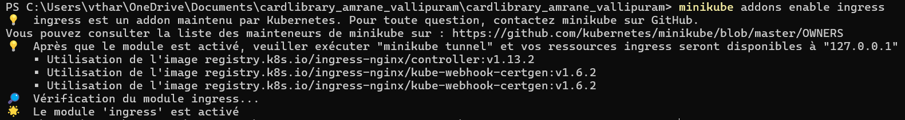
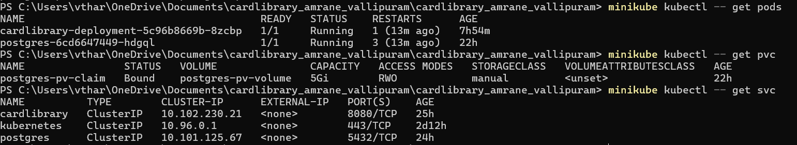
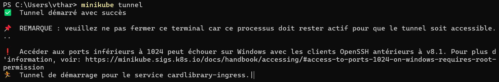
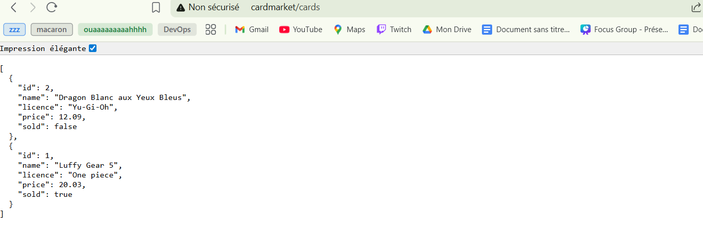
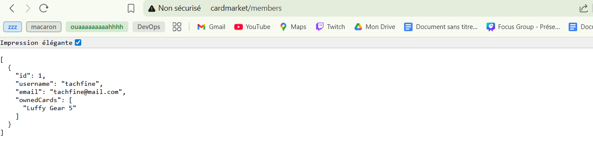
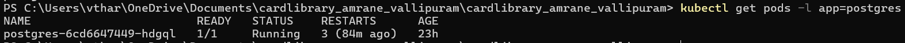
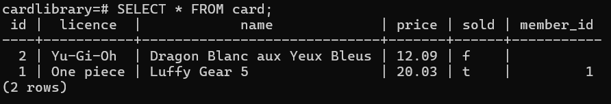
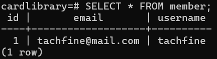
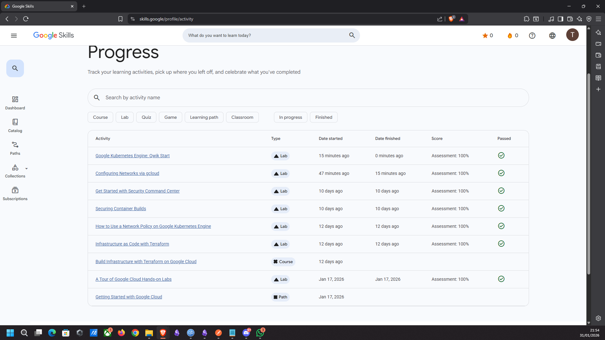
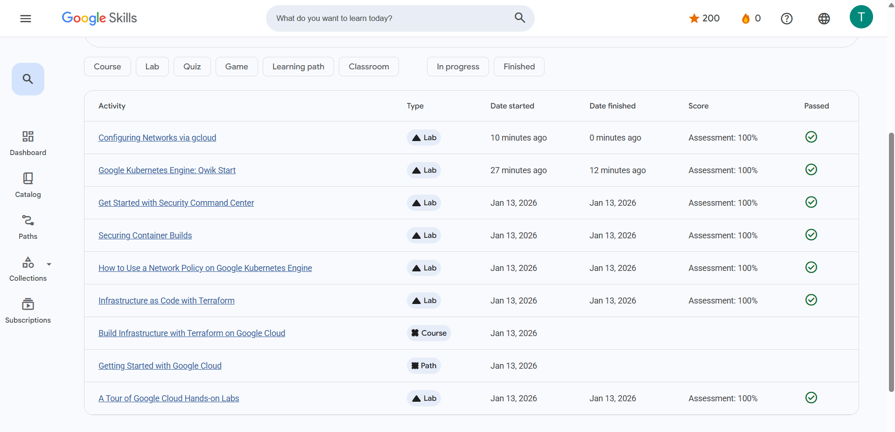

# Projet de bibliothèque de cartes - Architecture DevOps

Projet de Programmation distribuée, Cloud et DevOps
Ce projet consiste en une application de gestion de cartes de collection.

Dépôt Docker Hub : [hub.docker.com/r/tharsi12/cardlibrary](https://hub.docker.com/r/tharsi12/cardlibrary)

---

# 1. Prérequis
- Java 17
- Docker Desktop
- Minikube
- Postman
# 2. Mise en place de l'environnement
## Installation
1. Cloner le répertoire github
`git clone https://github.com/tharsi12/cardlibrary-amrane-vallipuram.git`
2. Lancer Docker
3. Ouvrir un terminal
4. Lancer Minikube
`minikube start`
5. Vérifier que le nœud est actif
`kubectl get nodes`
- *Résultat dans le terminal :*

6. Lancer Ingress
`minikube addons enable ingress`
- *Résultat dans le terminal :*

## Configuration du réseau
Ouvrir le fichier `C:\Windows\System32\drivers\etc\hosts` en tant qu'administrateur et ajouter cette ligne à la fin : `127.0.0.1 cardmarket`
## Déploiement des ressources Kubernetes
### Préparer Postgres et la sécurité :
Exécuter les commandes suivantes :
`kubectl apply -f postgres-storage.yaml`
`kubectl apply -f postgres-config.yaml`
`kubectl apply -f postgres-secret.yaml`
`kubectl apply -f rbac.yaml`
### Lancer la base de données
Exécuter :
`kubectl apply -f postgres.yaml`
### Lancer l'application (présente dans le Docker hub)
`kubectl apply -f cardlibrary-deployment.yaml`
`kubectl apply -f cardlibrary-service.yaml`
`kubectl apply -f cardlibrary-ingress.yml`
## Vérification du bon fonctionnement 
```bash
minikube kubectl -- get pods
minikube kubectl -- get pvc
minikube kubectl -- get svc
```
- *Résultat dans le terminal :*

## Activation de l'accès
Sur Windows et Mac, Ingress ne fonctionne pas si un tunnel n'est pas activé.
**Dans un terminal séparé** exécuter :
`minikube tunnel`
Le tunnel reste actif tant que la fenêtre de ce terminal reste ouverte.
*Résultat dans le terminal :*
- 
## Vérifier que les Pods sont actifs
Pour afficher l'état des pods, exécuter :
`kubectl get pods`
Attendre que les pods soient en état `Running`, ceci peut prendre quelques minutes.
# 4. Vérification et tests
## GET
Ces tests sont réalisables directement sur le navigateur en accédant aux liens ci-dessous :
- Obtenir la liste des cartes: `http://cardmarket/cards`
- *Résultat dans le navigateur :*

- Obtenir les détails d'une carte: `http://cardmarket/cards/{nom}`
- Obtenir la liste des membres: `http://cardmarket/members`
- *Résultat dans le navigateur :*

- Obtenir les détails d'un membre: `http://cardmarket/members/{nom}`
- Obtenir les cartes d'un membre: `http://cardmarket/members/{id}/cards`
## POST
Ces tests sont réalisables sur Postman
- Ajouter une carte:
```
POST http://cardmarket/cards
{
	"name": "Magicien des ténèbres",
	"licence": "Yu-Gi-Oh",
	"price": 50
}
```

- Ajouter un membre:
```
POST http://cardmarket/members
{
	"username": "user94",
	"email": "user94@gmail.com"
}
```
- Acheter une carte :`http://cardmarket/members/{id}/buy/{nom}`
## DELETE
Ces tests sont réalisables sur Postman
- Supprimer un membre: `http://cardmarket/members/{id}`
- Supprimer une carte: `http://cardmarket/cards/{nom}`
# 5. Accès à la Base de Données (PostgreSQL)

Si vous souhaitez vérifier directement le contenu des tables dans PostgreSQL depuis votre terminal.

## Récupérer le Pod PostgreSQL
```bash
kubectl get pods -l app=postgres
```
- *Résultat dans le terminal :*

## Connexion au shell PostgreSQL
```bash
kubectl exec -it {POD_NAME} -- psql -U postgres -d cardlibrary
```
## Requête
```text
Lister les tables : \dt
Voir les cartes enregistrées : SELECT * FROM card;
Voir les membres : SELECT * FROM member;
Quitter : \q
```
- *Résultat dans le terminal :*

- *Résultat dans le terminal :*

- *Résultat dans le terminal :*


# 6. Architecture du Système

```text
cardlibrabry_amrane_vallipuram/
│
├── src/
│   ├── main/
│   │   ├── java/
│   │   │   ├── data/                         # Couche d’accès aux données (JPA)
│   │   │   │   ├── Card.java                 # Entité représentant une carte
│   │   │   │   ├── CardRepository.java       # Repository pour les cartes
│   │   │   │   ├── Member.java               # Entité représentant un membre
│   │   │   │   └── MemberRepository.java     # Repository pour les membres
│   │   │   │
│   │   │   ├── exception/                    # Gestion des erreurs métier
│   │   │   │   ├── CardNotFoundException.java
│   │   │   │   └── MemberNotFoundException.java
│   │   │   │
│   │   │   ├── service/                      # Logique métier de l’application
│   │   │   │   ├── CardService.java          # Règles métier liées aux cartes
│   │   │   │   ├── MemberService.java        # Règles métier liées aux membres
│   │   │   │   └── CardClientService.java    # Gestion des interactions (achat de cartes)
│   │   │   │
│   │   │   ├── web/                          # Exposition REST (API HTTP)
│   │   │   │   ├── CardWebService.java       # Endpoints REST /cards
│   │   │   │   └── MemberWebService.java     # Endpoints REST /members
│   │   │   │
│   │   │   └── CardLibraryApplication.java   # Point d’entrée Spring Boot
│   │   │
│   │   └── resources/
│   │       └── application.properties       # Configuration Spring (DB, JPA, etc.)
│   │
│   └── test/                                # Tests unitaires et d’intégration
│       ├── CardServiceTest.java
│       ├── MemberServiceTest.java
│       ├── CardWebServiceTest.java
│       ├── MemberWebServiceTest.java
│       └── CardlibraryAmraneVallipuramApplicationTests.java
│
├── Dockerfile                              # Image Docker de l’application Spring Boot
├── docker-compose.yml                      # Lancement local (app + PostgreSQL)
│
├── cardlibrary-deployment.yaml             # Deployment Kubernetes de l’application
├── cardlibrary-service.yaml                # Service Kubernetes (ClusterIP)
├── cardlibrary-ingress.yml                 # Ingress pour exposer l’API vers l’extérieur
│
├── postgres.yaml                          # Deployment + Service PostgreSQL
├── postgres-config.yaml                   # Configuration de la base de données
├── postgres-secret.yaml                   # Secrets (login / mot de passe)
├── postgres-storage.yaml                  # Volume persistant PostgreSQL
│
├── pom.xml                                 # Configuration Maven et dépendances
├── mvnw                                   
├── mvnw.cmd                               
│
└── README.md                               
```

# Google Labs

Les Google Labs complétés par Tachfine Amrane : 



Les Google Labs complétés par Tharsikan Vallipuram : 



## Auteurs
- Tachfine Amrane
- Tharsikan Vallipuram

Université Paris Cité - Master MIAGE - 2025/2026